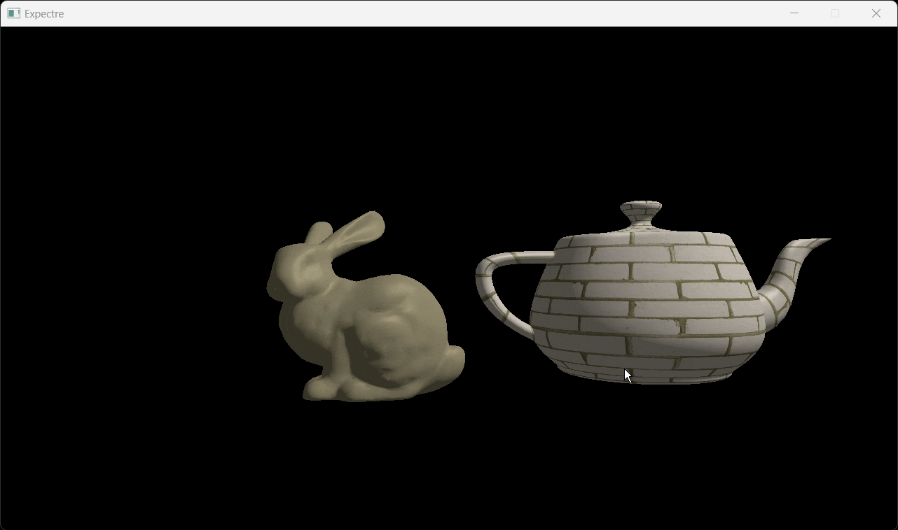

# Expectre

A real-time 3D engine built from scratch in C++20 and Vulkan 1.4. **Work in progress.**




## Overview

Expectre is a personal project to build a Vulkan renderer and engine framework. The goal is a **readable, approachable codebase** that demystifies real-time 3D application programming: clear naming, minimal indirection, and well-commented Vulkan calls so that each step from asset import to GPU-driven rendering is easy to follow.

## Architecture

```
Engine                     – Main loop, SDL3 window, frame timing
├── InputManager           – SDL event polling, key/mouse state, observer broadcasting
├── Scene                  – Assimp model import, scene graph, camera
│   ├── SceneObject        – Transform hierarchy (world/relative), mesh + material handles
│   ├── SceneRoot          – Root node
│   └── Camera             – FPS-style camera with keyboard/mouse input
├── RenderContextVk        – Vulkan instance, device, surface, VMA allocator setup
│   └── RendererVk         – Swapchain, render passes, pipelines, command recording, draw loop
│       ├── RenderResourceManager  – GPU vertex/index buffer sub-allocation, mesh uploads
│       ├── TextureVk              – Image creation, layout transitions, depth/stencil
│       └── NoesisUI               – Noesis GUI integration (offscreen + onscreen passes)
└── Asset Managers (singletons)
    ├── MeshManager        – Mesh import, deduplication, deferred GPU upload queue
    ├── MaterialManager    – PBR material import (albedo, normal, metallic, roughness, AO)
    └── TextureManager     – Texture loading (stb), deduplication, upload queue
```

## Features

### Vulkan Renderer
- Vulkan 1.4 with validation layers, VMA for memory management
- Configurable render passes via `RenderPassConfig` struct (load/store ops, layouts)
- Swapchain with mailbox present mode, double-buffered frames-in-flight
- Depth/stencil buffer with format auto-selection (D32_SFLOAT_S8 / D24_S8)
- Descriptor sets for UBO (MVP matrices) and combined image samplers
- GLSL shaders with Blinn-Phong lighting (ambient + diffuse + specular)

### Asset Pipeline
- Model import via Assimp with recursive scene graph construction
- PBR material definitions (albedo, normal, metallic, roughness, AO texture slots)
- Singleton managers for meshes, materials, and textures with handle-based lookups and deferred GPU upload queues
- Staging buffer uploads with single-time command buffers

### Scene Graph
- Tree of `SceneObject` nodes with parent–child relationships
- Per-node world and relative transforms (glm `mat4x3`)
- Separate `SceneRoot` as the transform origin
- Camera as a scene object with keyboard/mouse-driven movement

### Noesis GUI Integration
- [Noesis GUI](https://www.noesisengine.com/) (WPF-style XAML UI) rendered as a Vulkan overlay
- Offscreen compositing pass (`RenderOffscreen`) + onscreen pass within the main render pass
- XAML-driven layouts with theme support, animated toolbar with hover fade-in/out
- Custom local XAML and font providers for asset loading
- Observer-pattern input adapter that forwards SDL events to Noesis without leaking framework types into the core engine

### Tooling
- **Hot-reload shaders** — file watcher detects changes to `.vert`/`.frag` files, recompiles GLSL → SPIR-V via shaderc at runtime, and rebuilds the graphics pipeline without restarting
- Conan 2 package management for all third-party dependencies
- CMake build with Ninja, Clang/clang-cl toolchain

## Dependencies

| Library | Purpose |
|---------|---------|
| Vulkan 1.4 + shaderc | Graphics API + runtime shader compilation |
| SDL3 | Windowing, input, Vulkan surface |
| VMA | Vulkan memory allocation |
| Noesis GUI | XAML-based UI framework |
| Assimp | 3D model import |
| glm | Math (vectors, matrices, transforms) |
| stb_image | Texture loading |
| spdlog / fmt | Logging |
| xxHash | Hashing for asset deduplication |

## Build

### Prerequisites (installed locally, not managed by Conan)
- **Vulkan SDK 1.4+** — install from [LunarG](https://vulkan.lunarg.com/sdk/home) (provides Vulkan headers, loader, validation layers, and shaderc)
- **Noesis GUI SDK** — install from [noesisengine.com](https://www.noesisengine.com/) (set `NOESIS_ROOT` in CMakeLists.txt or place at `C:/noesis` on Windows)

### Package manager
- **Conan 2** + **CMake 3.15+** — all other dependencies (SDL3, glm, assimp, spdlog, stb, etc.) are pulled via Conan

#### Conan profile (llvm)
```
[settings]
os=Windows
arch=x86_64
build_type=Debug
compiler=clang
compiler.version=19
compiler.cppstd=20
compiler.runtime=dynamic
compiler.runtime_type=Debug
compiler.runtime_version=v144

[conf]
tools.cmake.cmaketoolchain:generator=Ninja
tools.build:compiler_executables = {"c": "clang", "cpp": "clang++"}
tools.compilation:verbosity=verbose

[tool_requires]
ninja/[*]
```

#### Build commands
```bash
conan install . -pr:h llvm -pr:b llvm --build=missing
cmake --preset conan-debug
cmake --build ./build/Debug/
```

